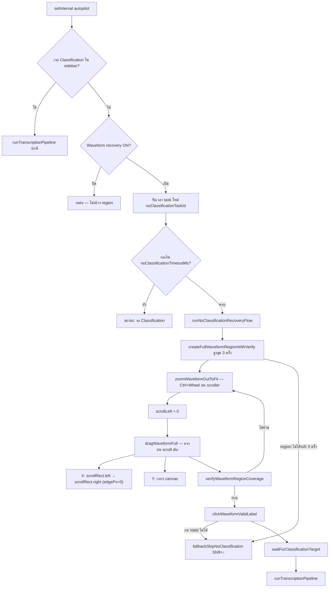

# DingTag — Flow การทำงาน

ไฟล์นี้เก็บ **flowchart + ขั้นตอน** สำหรับไล่ logic ทีหลัง — ไม่ใส่ใน `SKILL.md` (SKILL เน้น workflow ของ Agent)

**อัปเดต:** เมื่อเพิ่ม/เปลี่ยน flow ในโค้ด → แก้ไฟล์นี้ + บรรทัดสัญลักษณ์ใน [reference.md](reference.md) ถ้าจำเป็น

---

## สารบัญ

| Flow | เมื่อไหร่ | Entry ในโค้ด |
|------|----------|----------------|
| [Waveform region + Valid](#flow-waveform-region--valid) | ไม่มี Classification ใน sidebar | `runNoClassificationRecoveryFlow` |
| *(เพิ่ม flow ใหม่ด้านล่าง)* | | |

---

## Flow: Waveform region + Valid

**เงื่อนไข:** ไม่มี Classification ใน sidebar · เปิด **Waveform recovery** (`dingtag_auto_skip_no_classification`, default ON) · รอครบ `dingtag_no_classification_timeout_ms` (default 8s)

**ไฟล์หลัก:** `DingTalk_Extension/content.js` — ดู symbol ใน [reference.md](reference.md)

### ภาพรวม (autopilot → pipeline)

### ขั้นตอน recovery (หลัง timeout)

| ลำดับ | ฟังก์ชัน | ทำอะไร |
|------|---------|--------|
| 1 | `zoomWaveformOutToFit` | Ctrl+Wheel ลงบน `.lsf-audio-tag` scroller จน `scrollRatio ≤ 1.05` + `endGap` พอ |
| 2 | `scrollWaveformToStart` | `scrollLeft = 0` |
| 3 | `dragWaveformFull` | ลากบน `div[overflow:scroll]` — X จาก `scroller.getBoundingClientRect()`, ชิดขอบ (`edgePx=0`) |
| 4 | `verifyWaveformRegionCoverage` | เช็ค region เต็ม (DOM / canvas / timeline gap) — fail แล้ว retry ซูม+ลาก |
| 5 | `clickWaveformValidLabel` | ติดป้าย Valid |
| 6 | `waitForClassificationTarget` | รอ sidebar แสดง Classification |
| 7 | `runTranscriptionPipeline` | ถอดเสียง → formal → Update ตามเดิม |

### Fallback

- ลาก/verify ไม่ผ่าน 3 ครั้ง → `fallbackSkipNoClassification` (Shift+↓)
- กด Valid ไม่ได้ → เช่นเดียวกัน

### หมายเหตุ implementation

- **อย่า hardcode px** (867/1729) — ใช้ `scrollRatio` / `endGap` จาก `getWaveformZoomMetrics`
- รายละเอียดแก้บ่อย / symptom → [learnings.md](learnings.md)
- `localStorage`: `dingtag_auto_skip_no_classification`, `dingtag_no_classification_timeout_ms`
