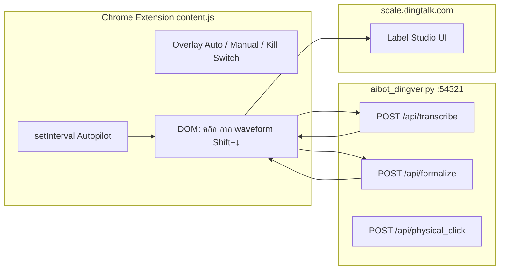
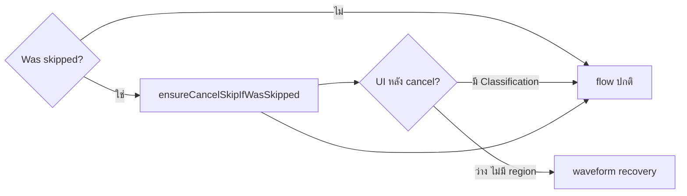
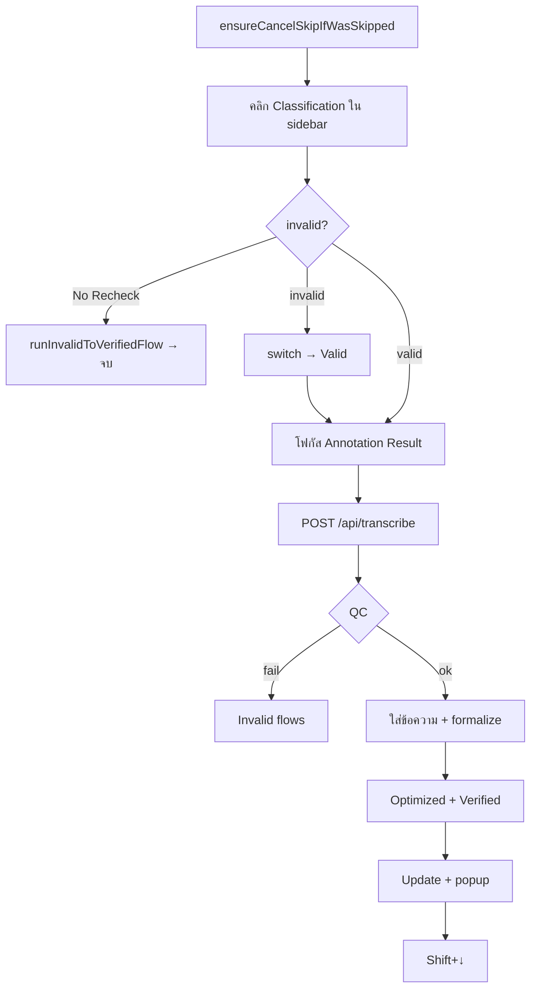
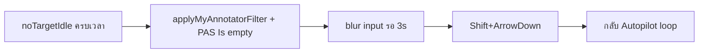

# DingTag — Flow การทำงาน

ไฟล์นี้เก็บ **flowchart + ขั้นตอน** สำหรับไล่ logic ทีหลัง — ไม่ใส่ใน `SKILL.md` (SKILL เน้น workflow ของ Agent)

**อัปเดต:** เมื่อเพิ่ม/เปลี่ยน flow ในโค้ด → แก้ไฟล์นี้ + บรรทัดสัญลักษณ์ใน [reference.md](reference.md) ถ้าจำเป็น

---

## สารบัญ

| Flow | เมื่อไหร่ | Entry ในโค้ด |
|------|----------|----------------|
| **[Master flow — ทั้งระบบ](#master-flow--ทั้งระบบ)** | ไล่จาก Autopilot จบ task | `setInterval` ~6575 · `content.js` |
| [สถาปัตยกรรม](#สถาปัตยกรรม) | Extension ↔ Local API ↔ หน้าเว็บ | `aibot_dingver.py` :54321 |
| [Precheck: Was skipped](#precheck-was-skipped) | งานเคย Shift+↓ skip — ไม่มีปุ่ม Update | `ensureCancelSkipIfWasSkipped` |
| [Waveform region + Valid](#flow-waveform-region--valid) | ไม่มี Classification ใน sidebar | `runNoClassificationRecoveryFlow` |
| [Pipeline หลัก (Valid)](#pipeline-หลัก-valid) | มี Classification ใน sidebar | `runTranscriptionPipeline` |
| [Invalid / QC branches](#invalid--qc-branches) | API หรือ QC ส่ง invalid | `runInvalid*Flow` |
| [Auto-Filter recovery](#auto-filter-recovery) | ไม่เจอ target นาน | `runAutoFilterRecovery` |

---

## ลำดับงานบน Label Studio (สำคัญ)

```
ลาก region บน waveform → กด Valid (กลางจอ) → Classification ขึ้นใน sidebar → pipeline
```

- Bot **ไม่รอ** sidebar มี Classification ก่อนเริ่ม — sidebar เป็นผลหลังลาก+Valid
- **"No region" (คำของทีม)** = UI ว่าง: ไม่มี Valid/Invalid ใน Annotation Item, มักขึ้น `No annotation items`, waveform ยังไม่มีช่วงเขียว — **ไม่ใช่**ข้อความใน combo เสมอไป

---

## Master flow — ทั้งระบบ

แผนเดียวต่อทุก branch หลัก (อ่านจากบนลงล่าง = ลำดับความสำคัญใน Autopilot)

```mermaid
flowchart TD
    subgraph Entry["จุดเริ่ม"]
        ON[Autopilot ON + โหมด Auto]
        POLL[setInterval ~500ms]
        ON --> POLL
    end

    POLL --> URL{URL / task เปลี่ยน?}
    URL -->|ใช่| RESET[resetTaskGate]

    RESET --> SKIPPED{Was skipped UI?<br/>isTaskWasSkipped / Cancel skip btn}
    SKIPPED -->|ใช่| KICK[kickPostCancelSkipHandling]
    KICK --> WAITDOM[รอ DOM ~900ms]
    WAITDOM --> CANCEL[ensureCancelSkipIfWasSkipped]
    CANCEL --> PAUSE[pauseWaveformMedia]
    PAUSE --> WAVEWAIT[waitForWaveformAnnotatable]
    WAVEWAIT --> REC

    SKIPPED -->|ไม่| PREP{needsPrePipelineAnnotationSteps?<br/>ไม่มี Classification ใน sidebar}
    PREP -->|ใช่| SCHED[scheduleNoClassificationRecovery<br/>หรือ timeout 8s ถ้าเปิด toggle]
    SCHED --> REC

    subgraph REC["Waveform recovery — runNoClassificationRecoveryFlow"]
        REC0[ensureCancelSkip ถ้ายัง skipped]
        REC0 --> REC1[zoomWaveformOutToFit]
        REC1 --> REC2[scrollWaveformToStart]
        REC2 --> REC3[dragWaveformFull]
        REC3 --> REC4{verify region ≤3 ครั้ง?}
        REC4 -->|ไม่ผ่าน| RECSKIP[fallbackSkipNoClassification Shift+↓]
        REC4 -->|ผ่าน| REC5[clickWaveformValidLabel]
        REC5 --> REC6[waitForClassificationTarget]
        REC6 --> PIPE
    end

    PREP -->|ไม่| HASCLS{scanClassificationTarget ใน sidebar?}
    HASCLS -->|ไม่| IDLE

    subgraph IDLE["รอ / ไม่เจอ target"]
        IDLE1[แสดงสถานะรอ task]
        IDLE1 --> AFCHK{Auto-Filter ON + idle นาน?}
        AFCHK -->|ใช่| AF[runAutoFilterRecovery]
        AFCHK -->|ไม่| POLL
        AF --> POLL
    end

    HASCLS -->|ใช่| DUP{task ซ้ำ / เคย Update?<br/>processedTaskIds}
    DUP -->|ซ้ำวน loop| DUPCLR[ล้าง history + Shift+↓]
    DUPCLR --> POLL
    DUP -->|พร้อมทำ| PIPE

    subgraph PIPE["Pipeline — runTranscriptionPipeline"]
        P0[ensureCancelSkipIfWasSkipped]
        P0 --> P0B{หลัง cancel = UI ว่าง?}
        P0B -->|ใช่| REC
        P0B -->|ไม่| P1[คลิก Classification ใน sidebar]

        P1 --> PCLS{valid หรือ invalid?}
        PCLS -->|invalid + No Recheck| INVMAIN[runInvalidToVerifiedFlow]
        PCLS -->|invalid ปกติ| SWV[switch Invalid → Valid]
        SWV --> P2
        PCLS -->|valid| P2[โฟกัส Annotation Result]

        P2 --> P3[fetchAudioAsBase64 → POST /api/transcribe]
        P3 --> QC{QC จาก API}
        QC -->|fail QC| INVQC[Invalid accept flows]
        QC -->|ผ่าน| P4[ใส่ข้อความ + POST /api/formalize]
        P4 --> P5[Optimized + Verified radios]
        P5 --> P6[Update + Ignore and Submit popup]
        P6 --> NEXT[goToNextTask Shift+↓]
    end

    INVMAIN --> NEXT
    INVQC --> NEXT
    RECSKIP --> POLL
    NEXT --> POLL
```

### ลำดับความสำคัญใน Autopilot (สรุป)

| ลำดับ | เงื่อนไข | ทางที่ไป |
|------|----------|----------|
| 1 | **Was skipped** | `kickPostCancelSkipHandling` → Cancel skip → recovery |
| 2 | ไม่มี **Classification ใน sidebar** | `runNoClassificationRecoveryFlow` |
| 3 | มี **Classification** | `runTranscriptionPipeline` |
| 4 | ไม่เจอ target นาน + **Auto-Filter ON** | `runAutoFilterRecovery` → กลับ loop |

### Mutex / กันซ้อน (ext 1.8.9+)

| ตัวแปร | กันอะไร |
|--------|---------|
| `postCancelSkipKickInFlight` | kick Cancel skip ซ้อน |
| `activeRecoveryTaskId` | recovery ซ้อนต่อ task |
| `isProcessing` | pipeline + autopilot ชนกัน |

---

## สถาปัตยกรรม



| โหมด | พฤติกรรม |
|------|----------|
| **Auto** | `extensionMode === "auto"` + Autopilot ON → loop หลัก |
| **Manual** | ถอดเสียง / formalize เอง |
| **Kill Switch** | ยกเลิก `runToken`, เคลียร์ `processedTaskIds` |

---

## Precheck: Was skipped

**เมื่อไหร่:** `.lsf-controls` แสดง `Was skipped` + ปุ่ม `Cancel skip` (`aria-label="cancel-skip"`) แทน `Update`

**ทำก่อน:** pipeline ปกติ / waveform recovery / กด Update (ใน `clickUpdateWithEnabledCheck`)



- ไม่กด Cancel skip → จบ pipeline แล้วไม่เจอ Update → bot อาจ Shift+↓ ซ้ำ งานไม่ถูกอัปเดตจริง
- หลัง Cancel skip → UI กลับโหมด annotation → มี Update เมื่อทำครบ
- Autopilot: `skippedUi` → `kickPostCancelSkipHandling` (กด Cancel skip ก่อน รอ waveform แล้ว recovery)
- หลัง Cancel skip เข้าสถานะว่าง → `isAnnotationPanelEmpty()` → waveform recovery

**Entry:** `ensureCancelSkipIfWasSkipped` · `kickPostCancelSkipHandling`

---

## Flow: Waveform region + Valid

**เงื่อนไข:** ไม่มี Classification ใน sidebar · เปิด **Waveform recovery** (`dingtag_auto_skip_no_classification`, default ON) · รอครบ `dingtag_no_classification_timeout_ms` (default 8s) หรือ autopilot เข้า `needsPrep` ทันที

**ไฟล์หลัก:** `DingTalk_Extension/content.js` — ดู symbol ใน [reference.md](reference.md)

### ขั้นตอน recovery

| ลำดับ | ฟังก์ชัน | ทำอะไร |
|------|---------|--------|
| 0 | `pauseWaveformMedia` / `waitForWaveformAnnotatable` | หยุดเสียงเล่น · รอ canvas พร้อม |
| 1 | `zoomWaveformOutToFit` | Ctrl+Wheel ลงบน `.lsf-audio-tag` scroller จน `scrollRatio ≤ 1.05` + `endGap` พอ |
| 2 | `scrollWaveformToStart` | `scrollLeft = 0` |
| 3 | `dragWaveformFull` | ลากบน `div[overflow:scroll]` — X จาก `scroller.getBoundingClientRect()`, ชิดขอบ (`edgePx=0`) |
| 4 | `verifyWaveformRegionCoverage` | เช็ค region เต็ม (DOM / canvas เฉพาะสีเขียว / timeline gap) — fail แล้ว retry ซูม+ลาก สูงสุด 3 ครั้ง |
| 5 | `clickWaveformValidLabel` | ติดป้าย Valid กลางจอ |
| 6 | `waitForClassificationTarget` | รอ sidebar แสดง Classification |
| 7 | `runTranscriptionPipeline` | ถอดเสียง → formal → Update ตามเดิม |

### Fallback

- ลาก/verify ไม่ผ่าน 3 ครั้ง → `fallbackSkipNoClassification` (Shift+↓)
- กด Valid ไม่ได้ → เช่นเดียวกัน

### หมายเหตุ implementation

- **อย่า hardcode px** — ใช้ `scrollRatio` / `endGap` จาก `getWaveformZoomMetrics`
- รายละเอียดแก้บ่อย / symptom → [learnings.md](learnings.md)
- `localStorage`: `dingtag_auto_skip_no_classification`, `dingtag_no_classification_timeout_ms`

**Entry:** `runNoClassificationRecoveryFlow` · `createFullWaveformRegionWithVerify`

---

## Pipeline หลัก (Valid)

**Entry:** `runTranscriptionPipeline` (~6173)



| ขั้น | รายละเอียด |
|------|------------|
| 1 | คลิก Classification (Valid/Invalid ใน sidebar) |
| 2 | `fetchAudioAsBase64` → `postTranscribe` |
| 3 | ใส่ transcript → `postFormalize` |
| 4 | refocus Classification · Escape · Optimized · Verified |
| 5 | Escape · `robustClick` Update · Ignore & Submit |
| 6 | รอ 2s · `goToNextTask` (Shift+↓) · scroll sidebar |

---

## Invalid / QC branches

เรียกจาก `runTranscriptionPipeline` เมื่อ QC/API ไม่ผ่าน หรือ Classification = Invalid

| ฟังก์ชัน | เมื่อไหร่ |
|----------|----------|
| `runInvalidToVerifiedFlow` | Invalid + toggle No Recheck |
| `runInvalidDataMissingAcceptFlow` | เงียบเกิน / เสียงแย่ / sensitive |
| `runInvalidNonTargetLanguageAcceptFlow` | non-target language |
| `runInvalidReasonAcceptFlow` | เหตุผล invalid อื่นๆ |

ท้าย flow ส่วนใหญ่ → Update (ถ้ามี) → Shift+↓

---

## Auto-Filter recovery

**เมื่อไหร่:** Autopilot ไม่เจอ Classification นาน · toggle **Auto-Filter ON** · มีปุ่ม Filters บนหน้า



**Entry:** `runAutoFilterRecovery` · hotkey Shift+↑ (ตั้ง filter manual)

---

## Grep หา entry เร็ว

```bash
rg "runNoClassificationRecoveryFlow|runTranscriptionPipeline|kickPostCancelSkipHandling|ensureCancelSkipIfWasSkipped" DingTalk_Extension/content.js
```
